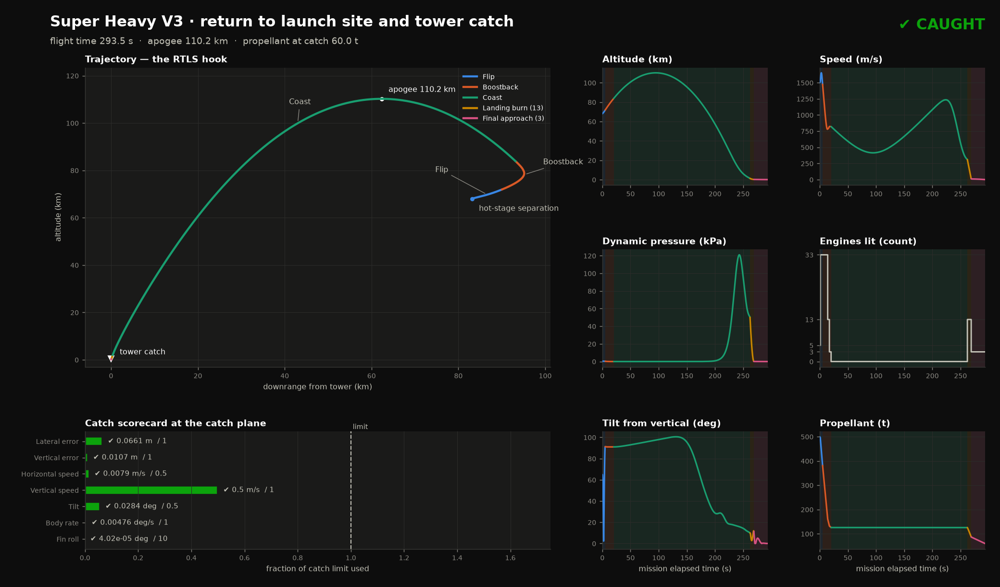
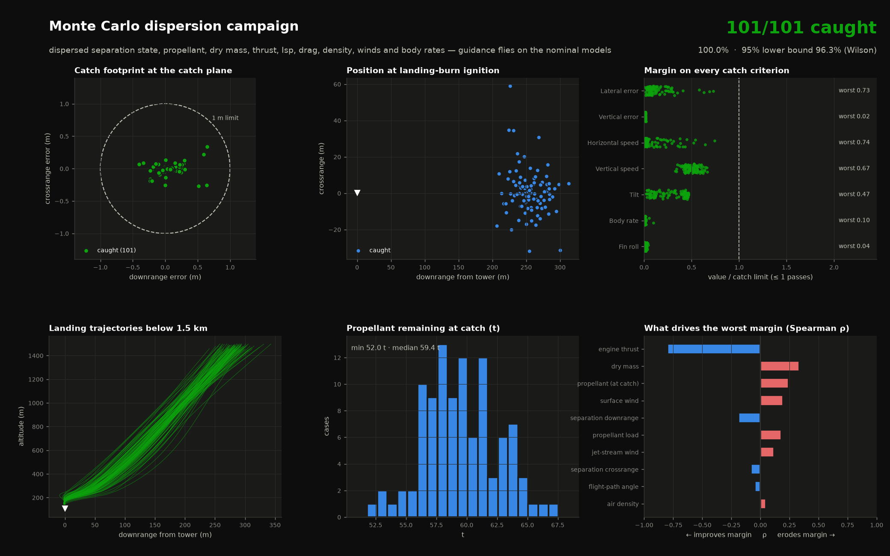

# quatsim — Super Heavy V3 return-to-launch-site and tower catch

A 6-DOF, quaternion-based simulation of a Super Heavy V3 booster from hot-stage
separation to the chopstick catch, with closed-loop guidance for every
phase, a Monte Carlo robustness campaign, publication-style figures and a
time-warped animation.



## Quick start

```bash
python -m venv .venv && source .venv/bin/activate
pip install -r requirements.txt
python -m pytest tests -q                  # 73 tests
python run_mission.py --figures            # nominal flight + 2 figures (~40 s)
python run_mission.py --animate            # figs/catch.mp4 (~6 min to render)
python run_mission.py --montecarlo 100     # dispersed campaign (~25 min on 3-4 cores)
```

`main.ipynb` runs the same steps as a notebook. Outputs go to `figs/`:

| file | what it shows |
|---|---|
| `mission_overview.png` | trajectory hook, phase-coloured time histories, catch scorecard |
| `landing_detail.png` | landing burn: to-scale side view, top view, descent rate, horizontal speed, tilt vs guidance envelope, throttle |
| `monte_carlo.png` | footprint, ignition dispersion, margin on every criterion, landing trajectories, propellant, sensitivity |
| `monte_carlo.csv` | one row per case: every dispersion and every scored value |
| `catch.mp4` | whole flight, time-warped by phase, camera zooming from 100 km to a to-scale tower close-up |

## Robustness result

**101 of 101 cases caught** (100 dispersed + nominal, seed 42): 95% lower
confidence bound on the catch rate 96.3% (Wilson). The same seed
caught 97/101 one iteration earlier, and 1/41 with the original guidance.



| criterion | limit | median | 95th pct | worst |
|---|---|---|---|---|
| lateral error | 1 m | 0.08 m | 0.35 m | 0.73 m |
| horizontal speed | 0.5 m/s | 0.01 m/s | 0.22 m/s | 0.37 m/s |
| vertical speed | 1 m/s | 0.51 m/s | 0.62 m/s | 0.67 m/s |
| tilt | 0.5° | 0.16° | 0.23° | 0.23° |
| body rate | 1°/s | 0.006°/s | 0.02°/s | 0.10°/s |
| vertical error | 1 m | 0.01 m | 0.02 m | 0.02 m |
| fin roll | 10° | 0.05° | 0.30° | 0.42° |

Propellant at catch: 52.0 t minimum, 59.4 t median. The tightest
margins are lateral error and horizontal speed in the strongest surface
winds (~12 m/s).

The catch criteria (all must pass, evaluated when the centre of mass reaches
the 105 m catch altitude): lateral error ≤ 1 m, vertical error ≤ 1 m,
horizontal speed ≤ 0.5 m/s, vertical speed ≤ 1 m/s, tilt ≤ 0.5°, body rate
≤ 1°/s, fin roll ≤ 10°.

Each case **plans** on the nominal models, **flies** a dispersed truth plant,
and **guides** on the nominal models plus what it can measure in flight
(see `quatsim/montecarlo.py`, 3-sigma values):

| dispersion | 3σ | dispersion | 3σ |
|---|---|---|---|
| separation altitude | 1.5 km | per-engine thrust | 3 % |
| separation downrange | 3 km | Isp | 2 % |
| separation crossrange | 500 m | dry mass | 1.5 % |
| separation speed | 30 m/s | drag coefficient | 15 % |
| flight-path angle | 1.5° | air density | 8 % |
| heading | 0.5° | surface wind | 0–12 m/s (uniform) |
| body rates | 0.5°/s/axis | jet-stream wind | 0–60 m/s (uniform), random direction/altitude/veer |
| propellant load | 15 t | wind forecast error | 30 % magnitude, 15° direction |

## What was wrong, and what replaced it

The starting point caught the booster on the nominal trajectory, but it was
a knife edge: shifting the separation point by 2 km missed the tower by
~1 km, and 5 m/s of crossrange velocity at separation missed by 330 m. Under
full dispersions it caught **1 of 41** cases. Each fix below came from a
diagnosed failure, in this order:

1. **The boostback predictor was discontinuous.** Engine-stage switches were
   evaluated only at 0.1 s step boundaries, so the predicted arrival jumped by
   ~4 km between neighbouring cutoff times. On top of that the root finder was
   a 7-step bisection (0.094 s ≈ 3 km resolution), and the nominal only hit
   because the aim point had been tuned around the chatter. The predictor
   now steps exactly onto stage boundaries and interpolates the altitude
   crossing. An Illinois-secant solver converges to 2 m in 4–6 shots and
   also solves the burn heading to null crossrange. It re-solves every 1.5 s
   during the burn (closed loop).
2. **Thrust dispersion dominated the arrival error** (ρ = −0.94). An
   IMU-style estimator measures thrust-to-mass during the flip and boostback,
   and tank gauging measures mass flow (an Isp error otherwise cut the burn
   early and arrived 750 m long). Both feed the predictor.
3. **No way to steer between boostback and landing.** Drag, density and wind
   errors moved the arrival point by hundreds of metres, and a 13-engine
   landing burn that cannot throttle below ~26 m/s² lasts only ~7 s and can
   divert only ~±250 m. The model gained a body normal-force (lift) term, and
   `quatsim/entry.py` adds grid-fin entry guidance: it predicts the arrival
   point, commands angle of attack within what the fins can hold against
   weathercocking, and uses a day-of-launch wind forecast plus an in-flight
   drag-scale estimator. Before the air is thick enough to steer, it holds
   the booster tail-first along the relative wind on RCS. Left alone it
   entered off-trim and swung ±25°, and with body lift those swings alone
   moved the arrival by ~1 km.
4. **The landing guidance was a stack of special cases**: crossrange was only
   ever damped, never steered to the target; the tilt taper was cancelled by
   a 20° floor; and drag was treated as always pointing up.
   `quatsim/landing.py` replaces it with one law in both engine phases:
   - vertical energy matching to a gate, then a constant-descent-plus-flare
     reference;
   - a 3-D thrust-vector solve including estimated drag and lift, with
     vertical priority under tilt and throttle limits;
   - a velocity-field lateral law that is bounded everywhere and time-capped
     so the approach speed is gone before a final settle window.
5. **The roll-to-catch could snap at 50°/s.** The coast delivers the fins
   ~180° from the catch orientation, and re-deciding the roll direction every
   step with `atan2` chattered. The direction is now decided once, at
   handover, and flown on a smooth time profile.
6. **A stopped vehicle could hover above the catch plane.** A constant flare
   feed-forward held it 0.1 m up until the tanks ran dry. The feed-forward
   now scales with the actual descent rate.
7. **Tuned from the plots.** The landing-detail figure showed the first
   terminal law catching, but as a 3 s, 0–12° tilt limit cycle. Lower
   lateral gains turned it into one smooth lean-and-return.
8. **Steady wind at the catch.** The softer gains left a ~0.9 m steady offset
   in a 12 m/s surface wind (a velocity field needs an error to produce a
   force). A disturbance observer compares measured horizontal acceleration
   with what the *actual* thrust vector should produce, and cancels the
   difference. Comparing with the command instead let attitude lag bias a
   calm-air catch by 0.3 m.

## Guidance, phase by phase

| phase | engines | guidance | module |
|---|---|---|---|
| flip | 5 → 33 | smooth pure-pitch slew | `mission.py` |
| boostback | 33 → 13 → 3 | predictive cutoff + heading, re-solved in flight; thrust and mass-flow estimators | `mission.py`, `phases.py` |
| reorient + coast | 0 | RCS hold tail-first to the relative wind; grid-fin entry steering once q > 1.5 kPa; drag estimator | `entry.py`, `phases.py` |
| landing brake | 13 | energy-matched vertical, velocity-field lateral, 3-D thrust vector | `landing.py` |
| final approach | 3 | constant descent + flare, velocity-field lateral + disturbance observer, closing tilt envelope, roll to catch | `landing.py` |

## Modelling notes and honest limits

- Aerodynamic coefficients (drag, weathercocking `cm_alpha`, body `cn_alpha`,
  grid-fin effectiveness) are **estimates**, not CFD. The Monte Carlo
  disperses drag and density, but not the moment or lift slopes.
- The catch target is the booster's **centre of mass** at 105 m. The
  animation draws the arms at hardpoint height (~35 m higher), where they
  would close.
- The final-approach throttle floor of 34% (below Raptor's nominal 40%) is
  inherited from the original model: 3 engines at 40% cannot descend in this
  mass model.
- Navigation is perfect (guidance reads the true state). The estimators
  measure the true acceleration, i.e. an ideal IMU.
- Grid-fin allocation is idealised (torque, not individual fin angles). Fin
  roll control is not modelled; roll uses RCS during the coast and
  differential gimbal under power.

The history of the original model's development is kept in `SOLUTION.md`.
